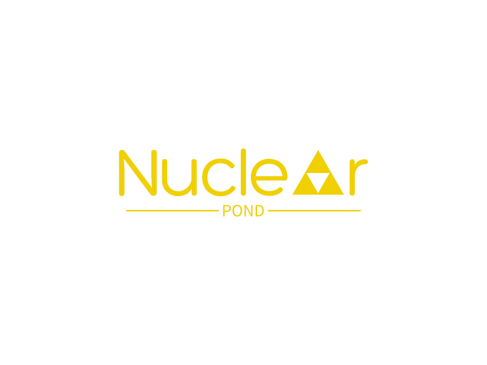

# Nuclear Pond V.2

We forked this project so we can continue with this great idea, I hope that together we can improve the code and make it available to everyone - @OFJAAAH



Nuclear Pond is used to leverage [Nuclei](https://github.com/projectdiscovery/nuclei) in the cloud with unremarkable speed, flexibility, and [perform internet wide scans for far less than a cup of coffee](https://devsecopsdocs.com/blog/nuclear-pond/). 

It leverages [AWS Lambda](https://aws.amazon.com/lambda/) as a backend to invoke Nuclei scans in parallel, choice of storing json findings in s3 to query with [AWS Athena](https://aws.amazon.com/athena/), and is easily one of the cheapest ways you can execute scans in the cloud. 

## Features

- Output results to your terminal, json, or to S3
- Specify threads and parallel invocations in any desired number of batches
- Specify any Nuclei arguments just like you would locally
- Specify a single host or from a file
- Run the http server to take scans from the API
- Run the http server to get status of the scans
- Query findings through Athena for searching S3
- Specify a custom nuclei and reporting configurations

## Usage

Think of Nuclear Pond as just a way for you to run Nuclei in the cloud. You can use it just as you would on your local machine but run them in parallel and with however many hosts you want to specify. All you need to think of is the nuclei command line flags you wish to pass to it. 

## Setup & Installation

To install Nuclear Pond, you need to configure the backend [terraform module]([[https://github.com/DevSecOpsDocs/terraform-nuclear-pond](https://github.com/KingOfBugbounty/terraform-nuclear-pond-OFJAAAH)](https://github.com/KingOfBugbounty/terraform-nuclear-pond-OFJAAAH)). You can do this by running `terraform apply` or by leveraging [terragrunt](https://terragrunt.gruntwork.io/). 

```bash
$ go install github.com/DevSecOpsDocs/nuclearpond@latest
```

## Environment Variables

You can either pass in your backend with flags or through environment variables. You can use `-f` or `--function-name` to specify your Lambda function and `-r` or `--region` to the specified region. Below are environment variables you can use. 

- `AWS_LAMBDA_FUNCTION_NAME` is the name of your lambda function to execute the scans on
- `AWS_REGION` is the region your resources are deployed
- `NUCLEARPOND_API_KEY` is the API key for authenticating to the API
- `AWS_DYNAMODB_TABLE` is the dynamodb table to store API scan states

### Command line flags

Below are some of the flags you can specify when running `nuclearpond`. The primary flags you need are `-t` or `-l` for your target(s), `-a` for the nuclei args, and `-o` to specify your output. When specifying Nuclei args you must pass them in as base64 encoded strings by performing `-a $(echo -ne "-t dns" | base64)`.

#### Commands

Below are the subcommands you can execute within nuclearpond.

- run: Execute nuclei scans
- service: Basic API to execute nuclei scans

### Run

To run nuclearpond subcommand `nuclearpond run -t devsecopsdocs.com -r us-east-1 -f jwalker-nuclei-runner-function -a $(echo -ne "-t dns" | base64) -o cmd -b 1` in which the target is `devsecopsdocs.com`, region is `us-east-1`, lambda function name is `jwalker-nuclei-runner-function`, nuclei arguments are `-t dns`, output is `cmd`, and executes one function through a batch of one host through `-b 1`.

```bash
$ nuclearpond run -h
Executes nuclei tasks in parallel by invoking lambda asynchronously

Usage:
  nuclearpond run [flags]

Flags:
  -a, --args string            nuclei arguments as base64 encoded string
  -b, --batch-size int         batch size for number of targets per execution (default 1)
  -f, --function-name string   AWS Lambda function name
  -h, --help                   help for run
  -o, --output string          output type to save nuclei results(s3, cmd, or json) (default "cmd")
  -r, --region string          AWS region to run nuclei
  -s, --silent                 silent command line output
  -t, --target string          individual target to specify
  -l, --targets string         list of targets in a file
  -c, --threads int            number of threads to run lambda functions, default is 1 which will be slow (default 1)
```

## Custom Templates

The terraform module by default downloads the templates on execution as well as adds the templates as a layer. The [variables to download templates](https://github.com/DevSecOpsDocs/terraform-nuclear-pond/blob/main/variables.tf#L16-L36) use the terraform github provider to download the release zip. The folder name within the zip will be located within `/opt`. Since Nuclei downloads them on run we do not have to but to improve performance you can specify `-t /opt/nuclei-templates-9.3.4/dns` to execute templates from the downloaded zip. To specify your own templates you must reference a release. When doing so on your own repository you must specify these variables in the terraform module, `github_token` is not required if your repository is public. 

- github_repository
- github_owner
- release_tag
- github_token

## Retrieving Findings

If you have specified `s3` as the output, your findings will be located in S3. The fastest way to get at them is to do so with Athena. Assuming you setup the terraform-module as your backend, all you need to do is query them directly through athena. You may have to configure query results if you have not done so already. 

```sql
select
  *
from
  nuclei_db.findings_db
limit 10;
```

### Advance Query

In order to get down into queries a little deeper, I thought I would give you a quick example. In the select statement we drill down into `info` column, `"matched-at"` column must be in double quotes due to `-` character, and you are searching only for high and critical findings generated by Nuclei.

```sql
SELECT
  info.name,
  host,
  type,
  info.severity,
  "matched-at",
  info.description,
  template,
  dt
FROM 
  "nuclei_db"."findings_db"
where 
  host like '%devsecopsdocs.com'
  and info.severity in ('high','critical')
```

## Infrastructure

The backend infrastructure, all within [terraform module](https://github.com/DevSecOpsDocs/terraform-nuclear-pond). I would strongly recommend reading the readme associated to it as it will have some important notes. 

- Lambda function
- S3 bucket
  - Stores nuclei binary
  - Stores configuration files
  - Stores findings
- Glue Database and Table
  - Allows you to query the findings in S3
  - Partitioned by the hour
  - Partition projection
- IAM Role for Lambda Function
